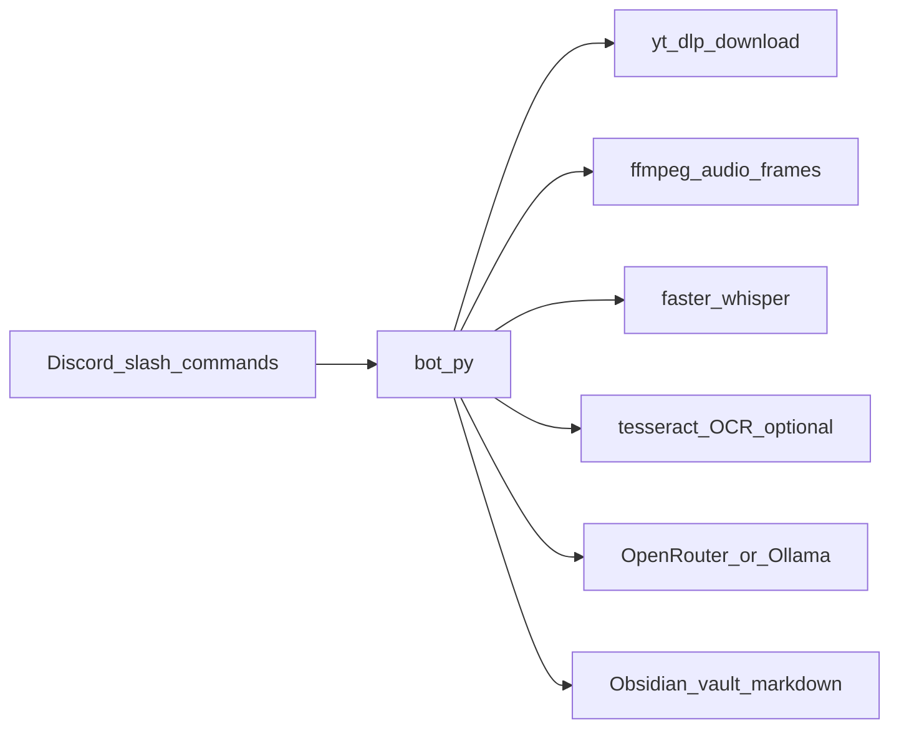
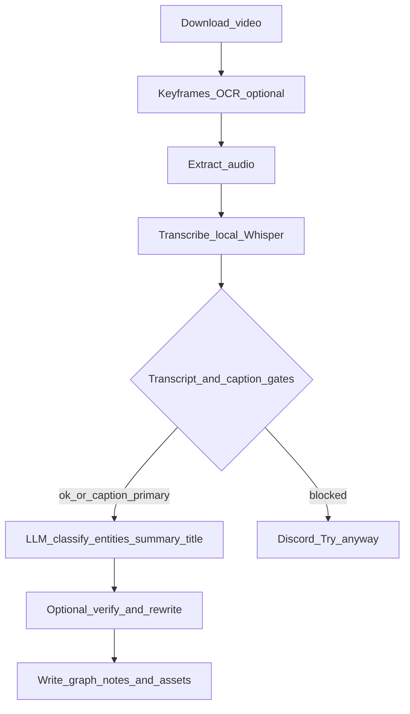

# NORA

**Turn Instagram reels into linked Obsidian notes from Discord** — structured summaries, topics, entities, and optional on-screen context — without losing the reel in your scroll history.

[](https://www.python.org/downloads/)
[](https://discord.com/developers/applications)
[](https://obsidian.md/)

## Why NORA

- **Problem:** Saved reels are easy to lose; plain transcripts miss what is *shown* on screen; music-only or mismatched audio produces useless “summaries.”
- **Outcome:** With default **`PIPELINE_MODE=graph`**, each `/save` produces a **hub video note** wired into **Topics**, **Entities**, and **category indexes**, with optional **keyframes + OCR** embedded in the note. With **`PIPELINE_MODE=basic`**, you get a **single** summary note per reel instead (see [Architecture](docs/architecture.md)).
- **Non-goals:** NORA is not a full social archive, hosted backup service, or guaranteed legal/compliance layer for third-party content — you own your vault and tooling choices.

**Documentation:** [Setup](docs/setup.md) · [Configuration](docs/configuration.md) · [Architecture](docs/architecture.md) · [Vault output](docs/vault-output.md) · [Troubleshooting](docs/troubleshooting.md) · [All docs](docs/README.md)

## How it works

### System context



### Pipeline and gates



For stage-by-stage detail, LLM labels, and repair paths, see [Architecture](docs/architecture.md).

## Public source vs private workspace

This project is often maintained as **NORA-private** (full dev tree) with an optional sanitized mirror (**NORA-open**) for sharing code without personal data. The mirror workflow excludes paths listed in [`.public-export-ignore`](.public-export-ignore), including:

- **Secrets and local state:** `.env`, `.venv`, `processed.json`
- **Personal content:** `vault/`, `NORA.md`, `agent-transcripts`
- **CI that publishes the mirror:** `.github/` (workflows live in the private repo only)
- **Tests and tooling:** `tests/`, `.cursor/`
- **Optional config file in mirror:** `taxonomy.json` (personal; defaults in code if absent). **`taxonomy.example.json`** is included as a copy-paste starter.

**NORA-open** clones get application code, **`docs/`**, and **`.env.example`**. **NORA-private** may include a vault, cookies, transcripts, and the publish workflow. Do not commit secrets or your Obsidian vault to a public remote.

## Free stack vs paid / cloud

| Tier | What runs where | When to use |
|------|-----------------|-------------|
| **Default (low recurring cost)** | Local: `ffmpeg`, `faster-whisper`, optional `tesseract`. LLM: **OpenRouter** (pick a model — free tiers vary by provider). | Day-to-day; good balance of quality and cost. |
| **Stronger summaries** | Same local stack; set `OPENROUTER_MODEL` to a **paid / stronger** model on OpenRouter. | When free models are too vague or inconsistent. |
| **Local / privacy LLM** | Omit `OPENROUTER_API_KEY`; use **Ollama** (`OLLAMA_MODEL`). | Keep prompts and completions on your machine. |
| **More cloud (extension point)** | Today, speech-to-text is **local Whisper**. A fully hosted pipeline would swap `transcribe_audio` in `process_link.py` for a cloud STT API — not shipped as a preset, but that is the natural seam if you want zero local ML. | Advanced self-hosting or fork. |

OpenRouter billing and model availability are defined by their service; local tools need Python, ffmpeg, and (for OCR) Tesseract on your PATH or via `OCR_TESSERACT_CMD`.

## Quick start

1. **Environment**

```powershell
python -m venv .venv
.\.venv\Scripts\Activate.ps1
python -m pip install --upgrade pip
pip install -r requirements.txt
Copy-Item .env.example .env
```

2. **Required in `.env`**

- `DISCORD_TOKEN`
- `OBSIDIAN_VAULT_PATH` (vault **root**, not `.obsidian`)
- `OPENROUTER_API_KEY` (recommended) — or leave empty and use Ollama

3. **Run**

```powershell
.\.venv\Scripts\python bot.py
```

4. **Discord:** `/save url:https://www.instagram.com/reel/...` or `/saveall`

Full prerequisites, Discord Developer Portal settings, and intents: [docs/setup.md](docs/setup.md).

## Extending NORA

| Hook | Primary location | Idea |
|------|------------------|------|
| Slash commands, Discord UX | `bot.py` | New commands, views, progress messages |
| Pipeline: download, transcribe, gates, LLM, writers | `process_link.py` | New sources, prompts, stages, STT backend swap |
| Categories and tag rules | `taxonomy.json` (copy from `taxonomy.example.json` if you want a starter file; not shipped in public mirror) | Your vocabulary and synonyms; `TAXONOMY_MODE=auto` appends new categories |
| Note shape and graph links | Writers in `process_link.py` (`_write_graph_notes`, etc.) | Extra folders, frontmatter, sections |
| Quality / gates | Env vars + `assess_*` / `build_obsidian_payload` | Stricter transcript or caption rules |

## Configuration (short)

- **Reference:** [docs/configuration.md](docs/configuration.md) and [`.env.example`](.env.example).
- **Minimum:** `DISCORD_TOKEN`, `OBSIDIAN_VAULT_PATH`, and either `OPENROUTER_API_KEY` or Ollama configured.

## Troubleshooting (quick)

- **Slash commands missing:** use `applications.commands` scope; wait ~30–60s after startup — [details](docs/troubleshooting.md#commands-do-not-appear).
- **`Failed to process link`:** check OpenRouter or Ollama, `ffmpeg`, and `python -m yt_dlp` in the same venv.
- **Notes not in vault:** `OBSIDIAN_VAULT_PATH` must be the vault root; see [Troubleshooting](docs/troubleshooting.md).
- **Downloads fail:** update `yt-dlp`; try `YTDLP_COOKIES_FROM_BROWSER` or `YTDLP_COOKIES_FILE`.
- **Weak or wrong summaries:** tune gates and models — [Quality tuning](docs/troubleshooting.md#quality-tuning-playbook).

## Files of interest

- `bot.py` — Discord entrypoints
- `process_link.py` — pipeline, multimodal path, note writers
- `taxonomy.example.json` — starter taxonomy (safe to ship publicly); copy to `taxonomy.json` to customize
- `taxonomy.json` — your categories (optional; built-in defaults if absent; omitted from public mirror export)
- `.env.example` — env template
- `processed.json` — URL dedupe (local; do not publish with private vault)
