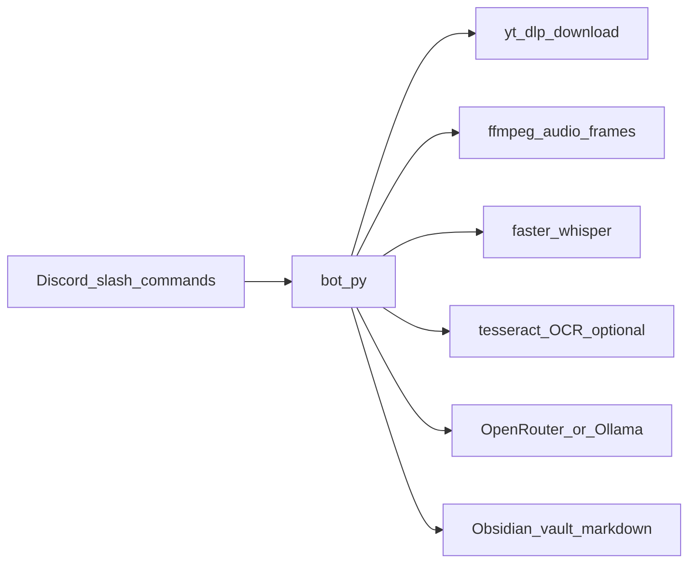
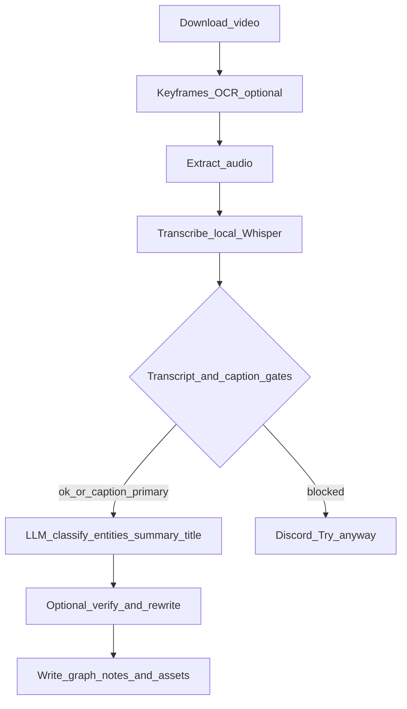

# How it works

Back to main [README](../README.md) · [All docs](README.md)

NORA is a local pipeline: Discord triggers a download of the reel, optional **keyframes + Tesseract OCR** (text snippets into prompts, not a vision model), local transcription, quality gates, then text LLM steps that classify and summarize into markdown your Obsidian vault can link together.

## System context

## Pipeline and gates

For stage-by-stage detail, LLM labels, repair paths, and temp/idempotency behavior, see [architecture.md](architecture.md).

The diagram merges graph LLM steps into one node; the **`title`** completion runs **only** when `TITLE_STYLE=clean` (see [configuration.md](configuration.md#discrete-string-options)).
